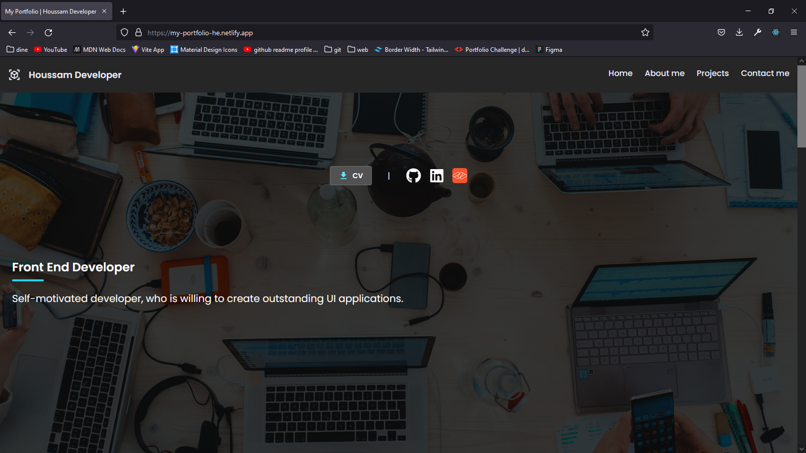

<!-- Please update value in the {}  -->

<h1 align="center">My Portfolio</h1>

<div align="center">
   Solution for a challenge from  <a href="http://devchallenges.io" target="_blank">Devchallenges.io</a>.
</div>

<div align="center">
  <h3>
    <a href="https://my-portfolio-he.netlify.app/">
      Demo
    </a>
    <span> | </span>
    <a href="https://github.com/houssam-developer/my-portfolio">
      Solution
    </a>
    <span> | </span>
    <a href="https://devchallenges.io/challenges/5ZnOYsSXM24JWnCsNFlt">
      Challenge
    </a>
  </h3>
</div>

<!-- TABLE OF CONTENTS -->

## Table of Contents

- [Overview](#overview)
  - [Built With](#built-with)
- [Features](#features)
- [How to use](#how-to-use)
- [Contact](#contact)
- [Acknowledgements](#acknowledgements)

<!-- OVERVIEW -->

## Overview



My portfolio can be found here: "https://my-portfolio-he.netlify.app/".
Thanks to that challenge, I learn to work efficiently in order to succeed.
And I hope to make more beautifuls websites and become an expert in front-end developmemt :)

### Built With

<!-- This section should list any major frameworks that you built your project using. Here are a few examples.-->

- [HTML]
- [CSS] 
- [React] (https://reactjs.org/)
- [React-Icons] (https://react-icons.github.io/react-icons/)
- [UUID] (https://www.npmjs.com/package/uuid)
- [Vite] (https://vitejs.dev/)
- [Tailwind] (https://tailwindcss.com/)

## Features

<!-- List the features of your application or follow the template. Don't share the figma file here :) -->

This application/site was created as a submission to a [DevChallenges](https://devchallenges.io/challenges) challenge. The [challenge](https://devchallenges.io/challenges/5ZnOYsSXM24JWnCsNFlt) was to build an application to complete the given user stories.

Challenge: Create all the elements in the given designs and then create a portfolio with your own content. You can create your own layout. You can use React, Vue.js, or other libraries to create a reusable component, but it is not required. Don’t look at the existing solution. Fulfill user stories below:

- User story: I can see personal details
- User story: I can see skills
- User story: I can see projects
- User story: I can filter projects by tag
- User story: I can see hobbies or certificates
- User story (optional): I can see experiences
- User story (optional): I can see blogs
- User story (optional): I can see projects on different pages

You can use your own color to make yours stand out

Icon: https://google.github.io/material-design-icons/

## How To Use

<!-- Example: -->

To clone and run this application, you'll need [Git](https://git-scm.com) and [Node.js](https://nodejs.org/en/download/) (which comes with [npm](http://npmjs.com)) installed on your computer. From your command line:

```bash
# Clone this repository
$ git clone https://github.com/houssam-developer/my-portfolio

# Install dependencies
$ npm install

# Run the app
$ npm run dev
```

## Acknowledgements

<!-- This section should list any articles or add-ons/plugins that helps you to complete the project. This is optional but it will help you in the future. For exmpale -->

- [Steps to replicate a design with only HTML and CSS](https://devchallenges-blogs.web.app/how-to-replicate-design/)
- [Node.js](https://nodejs.org/)
- [React] (https://reactjs.org/)
- [Vite] (https://vitejs.dev/)
- [Marked - a markdown parser](https://github.com/chjj/marked)

## Contact

- Website [my-portfolio-he.netlify.app/](https://my-portfolio-he.netlify.app/)
- GitHub [@houssam-developer](https://github.com/houssam-developer/my-portfolio)
